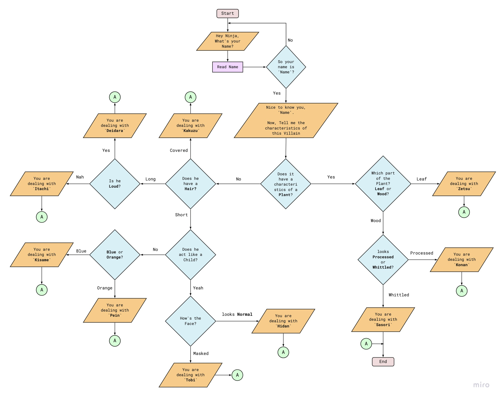

# Design Plan
## Flow Chart

The Flowchart starts by reading the user's name and then proceeds to the conditional questions in which the user describes the characteristics and lead to the concluded character's identity. 

There are ten possible end flow points of the chart.




## Test Scenarios
____

### Scenario #1 - Name Validation

```
Output: Hey Ninja, What is your Name? 
Input: Naruto
Output: So your name is Naruto?
Input: No
Output: Hey Ninja, What is your Name? 
Input: Sasuke
Output: So your name is Sasuke?
Input: Yes
Output:Nice to meet you, Sasuke.
Now Tell me the characteristics of this villain.
```

### Scenario #2 - Valid Answer Validation
```
Output: Does it have a characteristics of a Plant?
Input: 123
Output: Invalid Input. Try answering Yes/No or suggested choices.
```

### Scenario #3 - Concluded Character's Identity
```
Output: Does it have a characteristics of a Plant?
Input: Yes
Output: Which Part of the Plant? Leaf or Wood?
Input: Leaf
Output: You are dealing with Zetsu! 
He worked as an agent of the Akatsuki, in which he functioned as the organization's spy and worked alongside White Zetsu.
```